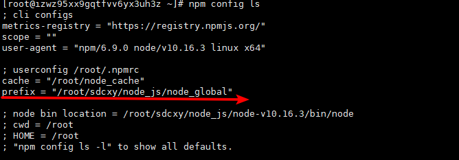
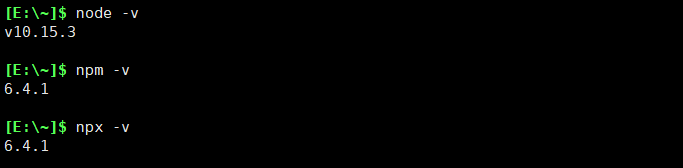

# linux 学习笔记  --- node.js环境配置
<!--more-->
1.  下载node.js
    ```
        https://nodejs.org/en/download/ 点击Linux Binaries (x64) 64-bit下载
        版本为 node-v10.16.3-linux-x64.tar.xz
    ```
2.  拷贝node-v10.16.3-linux-x64.tar.xz到服务器上,然后解压
    ```
        xz -d node-v10.16.3-linux-x64.tar.xz 将tar.xz解压为tar
        tar -xvf node-v10.16.3-linux-x64.tar 解压tar文件
        mv node-v10.16.3-linux-x64 node-v10.16.3 修改文件名称为 node-v10.16.3
    ```
3.  检查解压之后是否正常
    ```
        在目录 node_v10.16.3/bin/下 输入 ./node -v 能显示版本
        在大环境下输入 node -v 显示:  bash: node: command not fount
    ```
4.  配置软链接,设置全局命令
    ```
        执行一下命令：
        ln -s /root/..../node-v10.16.3/bin/node /usr/bin/node
        ln -s /root/..../node-v10.16.3/bin/npm  /usr/bin/npm
        ln -s /root/..../node-v10.16.3/bin/npx  /usr/bin/npx
        
     ```
     
5.  配置node_global 和 node_cache
    ```
        在自定义的目录下创建这两个文件夹
        例如： 目录 /root/.../node_js/
            mkdir node_global
            mkdir node_cache
        配置：
        npm config set prefix "node_global"
        npm config set cache "node_cache"
        查看配置:
        npm config ls
        查看所有配置（包含默认配置）
        npm config ls -l
    ```
    
6.  npm国内速度太慢 更新为淘宝镜像
    ```
        使用淘宝镜像cnpm:
        npm install cnpm -g --registry=https://registry.npm.taobao.org
        还是要跟第4步骤一样配置cnpm软链接(全局配置) 查看版本和配置方式与上面一致
    ```

