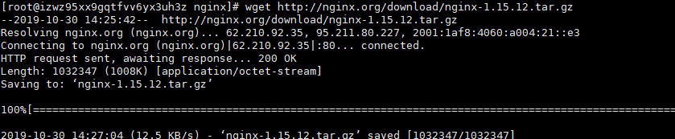
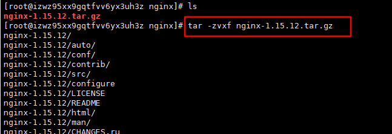
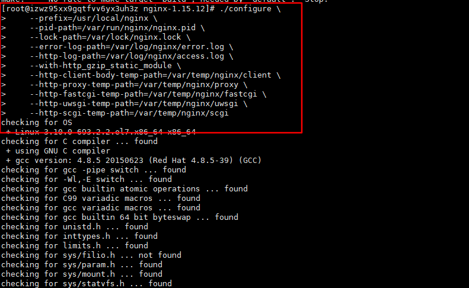
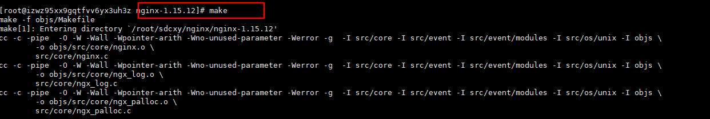
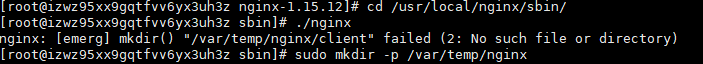
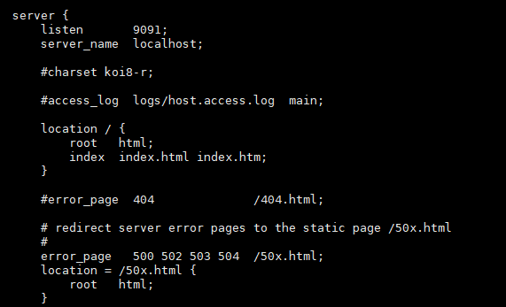
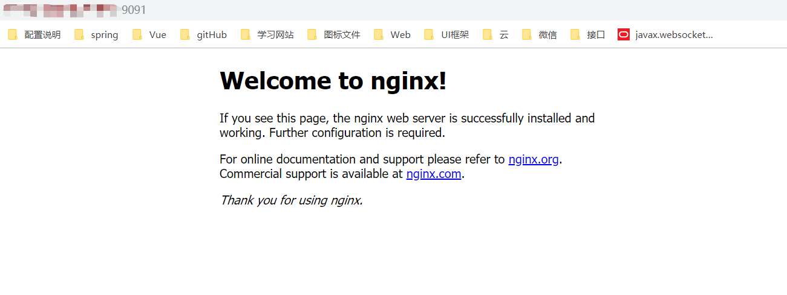

# linux 学习笔记  --- nginx安装
<!--more-->

##  1.下载nginx

*   下载nginx
    ```
        wget http://nginx.org/download/nginx-1.15.12.tar.gz
    ```


##  2. 解压nginx

*   解压nginx
    ```
        tar -zvxf nginx-1.15.12.tar.gz
    ```



##  3. 安装

*   先要安装先决条件（参考该博主）
    nginx 安装时候报错：make: *** No rule to make target `build', needed by `default'. Stop.
    ```
    
        博文地址：https://www.cnblogs.com/zrbfree/p/6419043.html
        根据系统版本安装：
        1、GCC——GNU编译器集合（GCC可以使用默认包管理器的仓库（repositories）来安装，包管理器的选择依赖于你使用的Linux发布版本，包管理器有不同的实现：yum是基于Red Hat的发布版本；apt用于Debian和Ubuntu；yast用于SuSE Linux等等。）
        
            RedHat中安装GCC：
            
            yum install gcc
            
            Ubuntu中安装GCC：
            
            apt-get install gcc
        
        2、PCRE库（Nginx编译需要PCRE（Perl Compatible Regular Expression），因为Nginx的Rewrite模块和HTTP核心模块会使用到PCRE正则表达式语法。这里需要安装两个安装包pcre和pcre-devel。第一个安装包提供编译版本的库，而第二个提供开发阶段的头文件和编译项目的源代码，这正是我们需要的理由。）
        
            RedHat中安装PCRE：
            
            yum install pcre pcre-devel
            
            Ubuntu中安装PCRE：
            
            apt-get install libpcre3 libpcre3-dev
        
        3、zlib库（zlib库提供了开发人员的压缩算法，在Nginx的各种模块中需要使用gzip压缩。如同安装PCRE一样，同样需要安装库和它的源代码：zlib和zlib-devel。）
        
            RedHat中安装zlib：
            
            yum install zlib zlib-devel
            
            Ubuntu中安装zlib：
            
            apt-get install zlib1g zlib1g-dev
        
        4、OpenSSL库（在Nginx中，如果服务器提供安全网页时则会用到OpenSSL库，我们需要安装库文件和它的开发安装包（openssl和openssl-devel）。）
        
            RedHat中安装OpenSSL：
            
            yum install openssl openssl-devel
            
            Ubuntu中安装OpenSSL：（注：Ubuntu14.04的仓库中没有发现openssl-dev）：
            
            apt-get install openssl openssl-dev
    ```
*   安装
    ```
        ./configure \
        --prefix=/usr/local/nginx \
        --pid-path=/var/run/nginx/nginx.pid \
        --lock-path=/var/lock/nginx.lock \
        --error-log-path=/var/log/nginx/error.log \
        --http-log-path=/var/log/nginx/access.log \
        --with-http_gzip_static_module \
        --http-client-body-temp-path=/var/temp/nginx/client \
        --http-proxy-temp-path=/var/temp/nginx/proxy \
        --http-fastcgi-temp-path=/var/temp/nginx/fastcgi \
        --http-uwsgi-temp-path=/var/temp/nginx/uwsgi \
        --http-scgi-temp-path=/var/temp/nginx/scgi
    ```
    
*   make 编译
    ```
        make
    ```
    
*   make 安装
    ```
        make install
    ```
    
    
##  4. 启动

*   启动nginx
    ```
        cd /usr/local/nginx/sbin/
        ./nginx
        出现该拨错：[emerg] mkdir() "/var/temp/nginx/client" failed (2: No such file or directory)
        执行以下命令：
        sudo mkdir -p /var/temp/nginx 
    ```
       
    
##  5. 修改配置文件

*   修改监听端口
    ```
        vi /usr/local/nginx/conf/nginx.conf
        默认为80端口 可以进修修改
        server {
                listen       9091;（修改此处端口）
                server_name  localhost;
        
                #charset koi8-r;
        
                #access_log  logs/host.access.log  main;
        
                location / {
                    root   html;
                    index  index.html index.htm;
                }
        
                #error_page  404              /404.html;
        
                # redirect server error pages to the static page /50x.html
                #
                error_page   500 502 503 504  /50x.html;
                location = /50x.html {
                    root   html;
                }

    ```
    
    
##  6. nginx基础命令

*   启动命令
    ```
        cd usr/local/nginx/sbin
        ./nginx
    ```
*   停止命令
    ```
        cd usr/local/nginx/sbin
        ./nginx -s stop
        ./nginx -s quit
    ```
*   重启命令
    ```
        cd usr/local/nginx/sbin
        ./nginx -s reload    
    ```
    
    
##  7. 部署

*   nginx 部署项目
    ```
        1.  将Vues打包的文件 dist 传输到服务器 /home/app/admin/dist/
            vi /usr/local/nginx/conf/nginx.conf
        2.  配置路径：
            location / {
                root   /home/app/admin/dist/;
                index  index.html index.htm;
            }
        3.  重启服务
            cd /usr/local/nginx/sbin
            ./nginx -s reload
    ```
