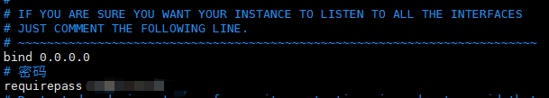
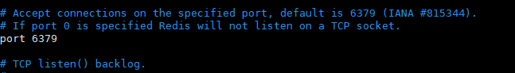
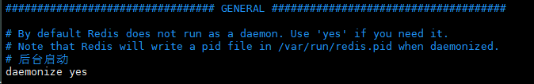
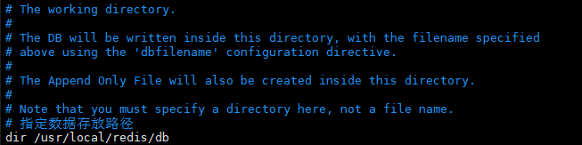

# linux 学习笔记  --- redis安装
<!--more-->

## 1、下载redis

* 下载 redis
    ```
    wget http://download.redis.io/releases/redis-5.0.4.tar.gz
    ```

## 2、解压redis

* 解压redis
    ```
    tar -zxvf redis-5.0.4.tar.gz
    ```
## 3、编译安装

* 编译
    ```
    进入redis目录
        cd redis-5.0.4
    编译
        make
    ```

* 安装
    ```
    安装
        make PREFIX=/usr/local/redis install
    ```

## 4、移动文件并修改配置文件

* 拷贝文件
    ```
    拷贝redis.conf到安装目录
         cp redis.conf /usr/local/redis
    ```

* 编辑配置文件
    ```
    进入目录
        cd /usr/local/redis/
    编辑redis.conf
        vim redis.conf
    ```






## 5、配置redis启动/停止

* 后台服务启动
    ```
     ./bin/redis-server ./redis.conf
    ```
* 查看
    ```
    ps aux | grep redis
    ```
* 客户端启动
    ```
     ./bin/redis-cli --raw //处理中文乱码问题    
    ```
* 停止
    ```
    1、./bin/redis-cli shutdown
    2、kill -9 pid 进程
    ```

