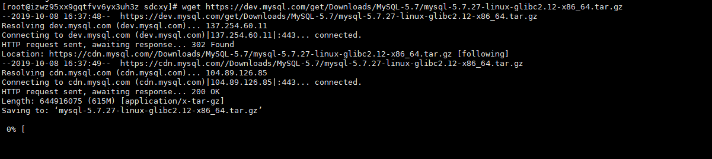
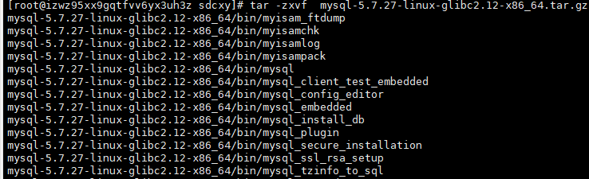
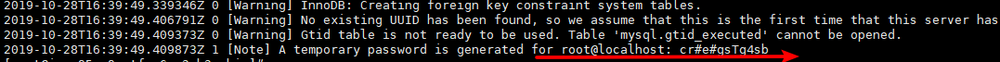
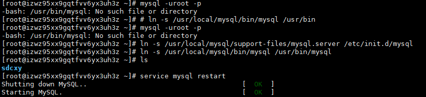
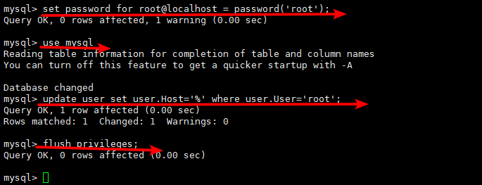

# linux 学习笔记  --- mysql安装配置
<!--more-->
1.  下载mysql
    ```
        官网地址下载：https://dev.mysql.com/downloads/file/?id=487642
        linux 下载： wget https://dev.mysql.com/get/Downloads/MySQL-5.7/mysql-5.7.27-linux-glibc2.12-x86_64.tar.gz
    ```
    
    
2.  解压mysql
    ```
        tar -zxvf  mysql-5.7.27-linux-glibc2.12-x86_64.tar.gz
        修改文件名称
        mv mysql-5.7.27-linux-glibc2.12-x86_64 mysql-5.7.27
    ```
    
3.  mysql目录授权给mysql组和mysql用户
    ```
        1.  创建mysql用户组和用户
            groupadd mysql
            useradd -r -g mysql -s /bin/false mysql
        2.  授权
            chown -R mysql:mysql /usr/local/mysql
            chmod -R 755 /usr/local/mysql
    ```
4.  初始化数据库
    ```
        1.  新建data文件夹
            mkdir /usr/local/mysql/data
        2.  初始化数据库 cd mysql
            bin/mysqld --initialize --user=mysql --basedir=/usr/local/mysql  --datadir=/usr/local/mysql/data
            *   报错
            bin/mysqld: error while loading shared libraries: libaio.so.1: cannot open shared object file: No such file or directory
            *   解决方法：执行以下命令
            yum install -y libaio 
    ```
    
5.  编辑my.cnf,添加配置
    ```
        vi /etc/my.cnf
        
        [mysqld]
        datadir=/usr/local/mysql/data
        port = 3306
        sql_mode=NO_ENGINE_SUBSTITUTION,STRICT_TRANS_TABLES
        symbolic-links=0
        max_connections=400
        innodb_file_per_table=1
        #表名大小写不明感，敏感为
        lower_case_table_names=1
    ```
6.  启动服务
    ```
        /usr/local/mysql/support-files/mysql.server start
    ```
    
7.  添加软连接
    ```
        ln -s /usr/local/mysql/support-files/mysql.server /etc/init.d/mysql 
        ln -s /usr/local/mysql/bin/mysql /usr/bin/mysql
        
        service mysql restart
    ```
8.  登录mysql修改密码
    ```
        *   输入临时密码
            mysql -u root -p  
        *   修改密码
            set password for root@localhost = password('你的密码'); 
    ```
9.  开启远程
    ```
        use mysql;
        update user set user.Host='%' where user.User='root';
        flush privileges;
    ```
    
