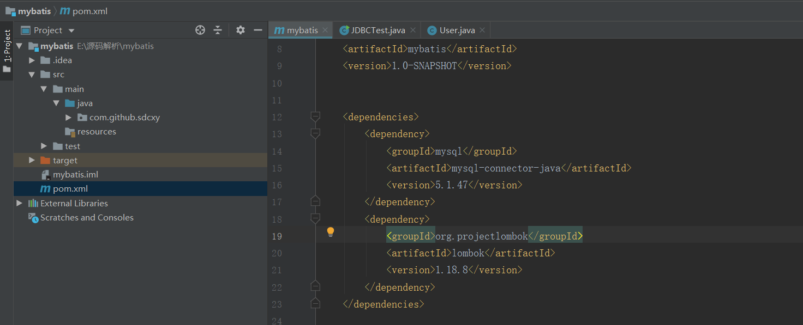

# mybatis 源码解析  --- 传统的JDBC实现方式
<!--more-->
1.  创建Maven工程，引入mysql依赖、lombok依赖(自动get/set)
    ```         
        <dependency>
           <groupId>mysql</groupId>
           <artifactId>mysql-connector-java</artifactId>
           <version>5.1.47</version>
        </dependency>
        <dependency>
            <groupId>org.projectlombok</groupId>
            <artifactId>lombok</artifactId>
            <version>1.18.8</version>
        </dependency>
    ```
    
2.  准备数据库数据
    ``` 
        创建数据库
        CREATE DATABASE `mybatis`
    ```
    ```
        创建表 sys_user
        DROP TABLE IF EXISTS `sys_user`;
        CREATE TABLE `sys_user`  (
          `id` int(11) NOT NULL AUTO_INCREMENT COMMENT '主键',
          `username` varchar(64) CHARACTER SET utf8 COLLATE utf8_general_ci NULL DEFAULT NULL COMMENT '用户名',
          `age` int(11) NULL DEFAULT NULL COMMENT '年龄',
          `telephone` varchar(32) CHARACTER SET utf8 COLLATE utf8_general_ci NULL DEFAULT NULL COMMENT '电话号码',
          `remark` varchar(255) CHARACTER SET utf8 COLLATE utf8_general_ci NULL DEFAULT NULL COMMENT '备注',
          PRIMARY KEY (`id`) USING BTREE
        ) ENGINE = InnoDB AUTO_INCREMENT = 1 CHARACTER SET = utf8 COLLATE = utf8_general_ci ROW_FORMAT = Dynamic;
        
        SET FOREIGN_KEY_CHECKS = 1;

    ```
    ```
        插入测试数据
        INSERT INTO `sys_user` VALUES (1, '小明', 18, '13800138000', '测试数据');
    ```
3.  创建测试类JDBCTest和实体类User
    ```
       实体类 User
       package com.github.sdcxy.entity;
       
       import lombok.Data;
       
       @Data
       public class User {
       
           private int id;
       
           private String username;
       
           private int age;
       
           private String telephone;
       
           private String remark;
       }
    ```
    ```
        测试类JDBCTest
        package com.github.sdcxy.jdbc;
        
        import com.github.sdcxy.entity.User;
        
        import java.sql.*;
        
        public class JDBCTest {
        
            public static void main(String[] args) {
        
                Connection connection = null;
                PreparedStatement preparedStatement = null;
                ResultSet resultSet = null;
                // 创建一个User对象来接收查询结果
                User user = new User();
                try{
                    //加载驱动
                    Class.forName("com.mysql.jdbc.Driver");
                    // 设置数据库源
                    String url = "jdbc:mysql://localhost:3306/mybatis?useUnicode=true&characterEncoding=utf8&useSSL=false";
                    String username = "root";
                    String password = "root";
                    // 获取数据库链接
                    connection = DriverManager.getConnection(url,username,password);
                    // 查询数据库语句
                    String sql = "select * from sys_user where id=?";
                    // 查询数据库
                    preparedStatement = connection.prepareStatement(sql);
                    preparedStatement.setInt(1,1);
                    // 获得结果集
                    resultSet = preparedStatement.executeQuery();
                    // 遍历结果集
                    while (resultSet.next()) {
                        user.setId(resultSet.getInt("id"));
                        user.setUsername(resultSet.getString("username"));
                        user.setAge(resultSet.getInt("age"));
                        user.setTelephone(resultSet.getString("telephone"));
                        user.setRemark(resultSet.getString("remark"));
                    }
                    System.out.println(
                            "{"+"id:" + user.getId()+","
                               +"username:"+user.getUsername()+","
                               +"age:"+user.getAge()+","
                               +"telephone:"+user.getTelephone()+","
                               +"remark:"+user.getRemark() +"}"
                            );
                } catch (ClassNotFoundException e) {
                    e.printStackTrace();
                } catch (SQLException e) {
                    e.printStackTrace();
                }finally {
                    close(connection,preparedStatement,resultSet);
                }
            }
            
            private static void close(Connection connection,PreparedStatement preparedStatement,ResultSet resultSet){
                    try{
                        if (resultSet != null) {
                            resultSet.close();
                        }
                        if (preparedStatement != null) {
                            preparedStatement.close();
                        }
                        if (connection != null) {
                            connection.close();
                        }
                    } catch (SQLException e) {
                        e.printStackTrace();
                    }
                }
        }
        执行结果：
        {id:1,username:小明,age:18,telephone:13800138000,remark:测试数据}
    ```
4.  JDBC实现方式的弊端
    ```
        1、加载驱动硬编码的方式
        2、sql语句与代码耦合,不利于代码的开发维护
        3、每次都需要链接和关闭，消耗很大的资源
        4、结果集中的数据类型需要手动判断
        5、sql语句硬编码的方式，不利于开发
        
    ```
5.  源码地址：
    ```
        https://github.com/sdcxy/parse_source_code
    ```
