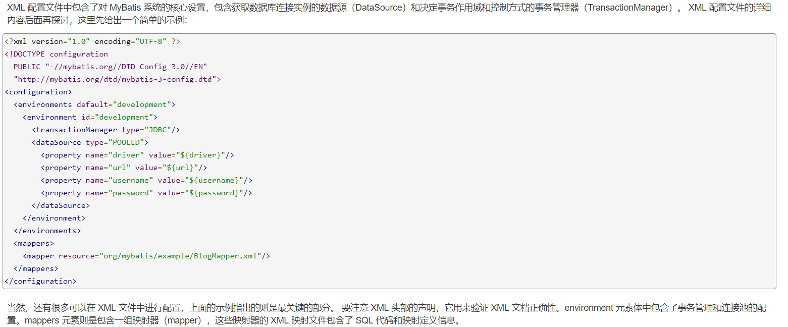
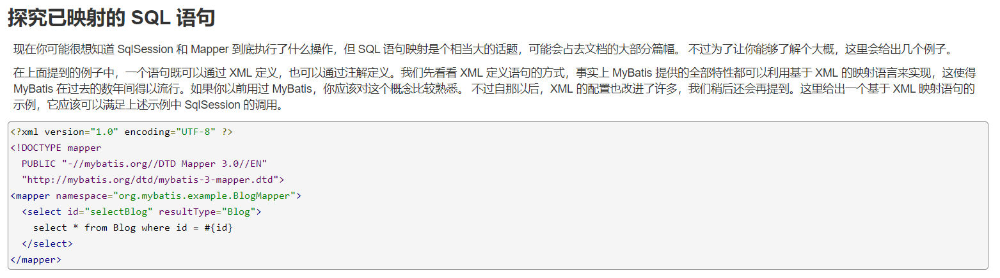
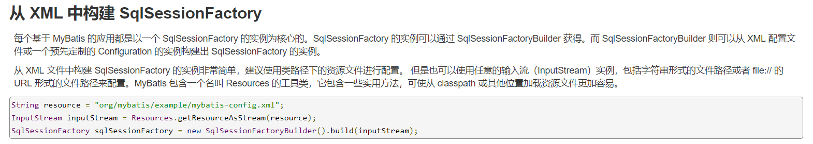
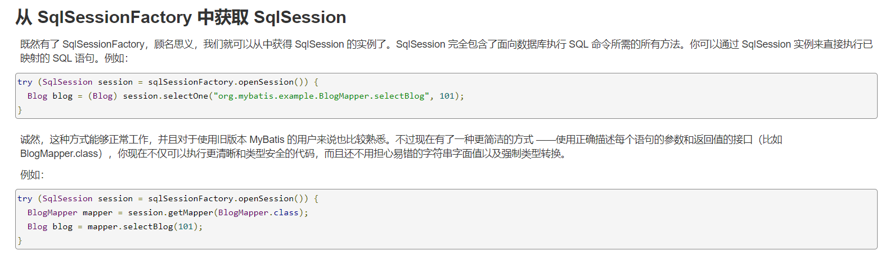

# mybatis 源码解析  --- mybatis开始使用
<!--more-->
###  什么是mybatis
    ```
        MyBatis 是一款优秀的持久层框架，它支持定制化 SQL、存储过程以及高级映射。
        MyBatis 避免了几乎所有的 JDBC 代码和手动设置参数以及获取结果集。
        MyBatis 可以使用简单的 XML 或注解来配置和映射原生类型、接口和 Java 的 POJO（Plain Old Java Objects，普通老式 Java 对象）为数据库中的记录。
    ```
#### 使用读取XML文件的方式
1.  开始使用
    ```
        查看官网说明：https://mybatis.org/mybatis-3/zh/getting-started.html
        引入mybatis依赖
        <dependency>
            <groupId>org.mybatis</groupId>
            <artifactId>mybatis</artifactId>
            <version>3.5.2</version>
        </dependency>
    ```
2.  在resources新建一个mybatis-config.xml全局配置文件
    根据官网的说明：需要配置数据源
    
    ```
        mybatis-config.xml配置如下：
        <?xml version="1.0" encoding="UTF-8" ?>
        <!DOCTYPE configuration
                PUBLIC "-//mybatis.org//DTD Config 3.0//EN"
                "http://mybatis.org/dtd/mybatis-3-config.dtd">
        <configuration>
            <properties>
                <property name="driver" value="com.mysql.jdbc.Driver"/>
                <property name="url" value="jdbc:mysql://localhost:3306/mybatis?useUnicode=true&amp;characterEncoding=utf8&amp;useSSL=false"/>
                <property name="username" value="root"/>
                <property name="password" value="root"/>
            </properties>
            <environments default="development">
                <environment id="development">
                    <transactionManager type="JDBC"/>
                    <dataSource type="POOLED">
                        <property name="driver" value="${driver}"/>
                        <property name="url" value="${url}"/>
                        <property name="username" value="${username}"/>
                        <property name="password" value="${password}"/>
                    </dataSource>
                </environment>
            </environments>
            <mappers>
                <mapper resource="UserMapper.xml"/>
            </mappers>
        </configuration>
    ```
3.  根据官方文档，还需要创建一个UserMapper.xml
    
    ```
        UserMapper.xml文件:
        <?xml version="1.0" encoding="UTF-8" ?>
        <!DOCTYPE mapper
                PUBLIC "-//mybatis.org//DTD Mapper 3.0//EN"
                "http://mybatis.org/dtd/mybatis-3-mapper.dtd">
        <mapper namespace="com.github.sdcxy.mybatis.mapper.UserMapper">
            <select id="selectUser" resultType="com.github.sdcxy.entity.User">
            select * from sys_user where id = #{id}
          </select>
        </mapper>
    ```
4.  新建一个com.github.sdcxy.mybatis.mapper.UserMapper接口类
    ```
        接口方法与xml配置文件id名称一致
        package com.github.sdcxy.mybatis.mapper;
        
        import com.github.sdcxy.entity.User;
        
        public interface UserMapper {
        
            User selectUser(int id);
        }
    ```
5.  新建mybatis测试类
    
    
    ```
        package com.github.sdcxy.mybatis;
        
        import com.github.sdcxy.entity.User;
        import com.github.sdcxy.mybatis.mapper.UserMapper;
        import org.apache.ibatis.io.Resources;
        import org.apache.ibatis.session.SqlSession;
        import org.apache.ibatis.session.SqlSessionFactory;
        import org.apache.ibatis.session.SqlSessionFactoryBuilder;
        
        import java.io.IOException;
        import java.io.InputStream;
        
        public class MybatisTest {
        
            public static void main(String[] args) {
                // 读取xml文件的方式
                readXmlMethod();
            }
        
            private static void readXmlMethod(){
                try{
                    // 获取全局配置路径
                    String resource = "mybatis-config.xml";
                    // 使用Resources.getResourceAsStream加载全局配置文件
                    InputStream inputStream = Resources.getResourceAsStream(resource);
                    // 调用SqlSessionFactoryBuilder()方法构建读取到的数据源信息
                    SqlSessionFactory sqlSessionFactory = new SqlSessionFactoryBuilder().build(inputStream);
                    // 调用SqlSessionFactory.openSession()方法获取到SqlSession对象
                    SqlSession session = sqlSessionFactory.openSession();
                    // 加载UserMapper到session Mapper中
                    UserMapper userMapper = session.getMapper(UserMapper.class);
                    // 调用方法返回User对象
                    User user = userMapper.selectUser(1);
                    System.out.println(user);
                } catch (IOException e) {
                    e.printStackTrace();
                }
            }
        }
        
        结果返回：
        User(id=1, username=小明, age=18, telephone=13800138000, remark=测试数据)
    ```
6.  源码地址：
    ```
        https://github.com/sdcxy/parse_source_code
    ```    
