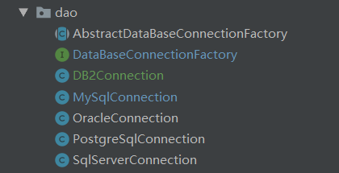
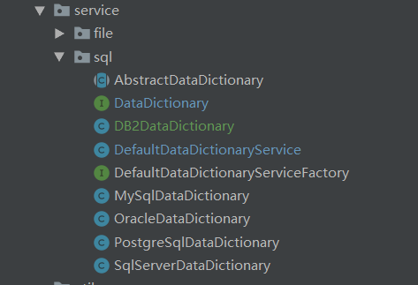
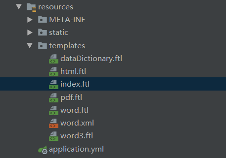
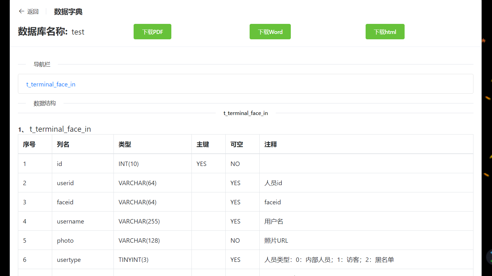
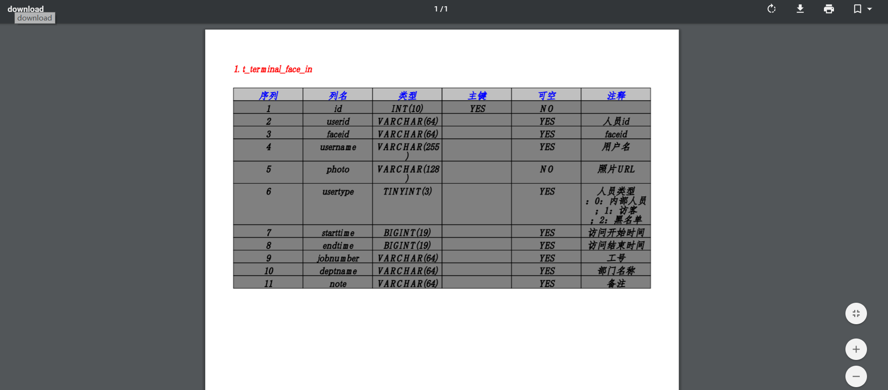

# 工作经验分享 --- 数据字典
<!--more-->
### 数据字典（Data Dictionary）
*   因工作需要，将数据库表结构及注释生成数据字典，因此开发了一个该工具类。

####  1、什么是数据字典？
*   数据字典是指对数据的数据项、数据结构、数据流、数据存储、处理逻辑等进行定义和描述，其目的是对数据流程图中的各个元素做出详细的说明，使用数据字典为简单的建模项目。
简而言之，数据字典其实就是描述数据的信息集合，是对系统中使用的所有数据元素的定义的集合。
*   目前开发的这个工具功能比较简单,实现了Mysql、SqlServer、PostgreSQL、
    Oracle、DB2 表结构和注释导出，生成Word/PDF/HTML格式

####  2、开发前准备

1.  查找资料，查找相关的工具类
2.  搜集可能用到的常见数据库，主要用了Mysql/SqlServer/Oracle/DB2/PostgreSQL
3.  下载相关的数据库驱动包（这里使用的Maven构建来管理jar包）

####  3、如何实现

1.  使用Maven来管理项目
2.  使用Springboot+Freemarker模板来实现可视化和处理
3.  使用itextpdf工具来生成PDF文件

####  4、开始开发

1.  开发环境 jdk 1.8 
2.  开发工具 idea
3.  创建SpringBoot项目 data-dictionary
4.  引入依赖  
    ```
        <properties>
            <project.build.sourceEncoding>UTF-8</project.build.sourceEncoding>
            <maven.compiler.source>1.8</maven.compiler.source>
            <maven.compiler.target>1.8</maven.compiler.target>
            <!--工具类-->
            <lombok.version>1.18.8</lombok.version>
            <alibaba.fastjson.version>1.2.60</alibaba.fastjson.version>
            <itextpdf.version>5.5.13.1</itextpdf.version>
            <itextpdf.xhtmlrenderer.version>9.1.18</itextpdf.xhtmlrenderer.version>
            <itextpdf.asian.version>5.2.0</itextpdf.asian.version>
            <itext.rtf.version>2.1.7</itext.rtf.version>
            <apache.lang3.version>3.9</apache.lang3.version>
            <!--数据库-->
            <mysql.version>5.1.47</mysql.version>
            <mssql.jdbc.version>7.2.2.jre8</mssql.jdbc.version>
            <postgreSql.version>42.2.8</postgreSql.version>
            <oracle.version>12.1.0.2</oracle.version>
        </properties>
    <!--这里使用springboot自动加载依赖的方式-->
         <dependencyManagement>
            <dependencies>
                <dependency>
                    <groupId>org.springframework.boot</groupId>
                    <artifactId>spring-boot-dependencies</artifactId>
                    <version>2.1.6.RELEASE</version>
                    <type>pom</type>
                    <scope>import</scope>
                </dependency>
            </dependencies>
         </dependencyManagement>         
         <dependencies>
             <dependency>
                <groupId>org.springframework.boot</groupId>
                <artifactId>spring-boot-autoconfigure</artifactId>
             </dependency>
             <dependency>
                <groupId>org.springframework.boot</groupId>
                <artifactId>spring-boot-configuration-processor</artifactId>
             </dependency>
             <!--freemarker-->
             <dependency>
                <groupId>org.springframework.boot</groupId>
                <artifactId>spring-boot-starter-freemarker</artifactId>
             </dependency>
             <!--工具类-->
             <dependency>
                <groupId>org.projectlombok</groupId>
                <artifactId>lombok</artifactId>
             </dependency>
             <!-- https://mvnrepository.com/artifact/com.itextpdf/itextpdf -->
             <dependency>
                <groupId>com.itextpdf</groupId>
                <artifactId>itextpdf</artifactId>
             </dependency>
             <!-- https://mvnrepository.com/artifact/com.itextpdf/itext-asian -->
             <dependency>
                <groupId>com.itextpdf</groupId>
                <artifactId>itext-asian</artifactId>
             </dependency>
             <dependency>
                <groupId>com.alibaba</groupId>
                <artifactId>fastjson</artifactId>
             </dependency>
             <dependency>
                <groupId>org.apache.commons</groupId>
                <artifactId>commons-lang3</artifactId>
             </dependency>
             <!--数据库-->
             <dependency>
                <groupId>mysql</groupId>
                <artifactId>mysql-connector-java</artifactId>
             </dependency>
             <dependency>
                <groupId>com.microsoft.sqlserver</groupId>
                <artifactId>mssql-jdbc</artifactId>
             </dependency>
             <!-- https://mvnrepository.com/artifact/org.postgresql/postgresql -->
             <dependency>
                 <groupId>org.postgresql</groupId>
                 <artifactId>postgresql</artifactId>
                 <version>${postgreSql.version}</version>
             </dependency>
             <dependency>
                 <groupId>com.oracle</groupId>
                 <artifactId>ojdbc7</artifactId>
                 <version>${oracle.version}</version>
             </dependency>
         </dependencies>
    ```
####  4、数据库连接

1.  创建DataBaseConnectionFactory数据库连接工厂，每一个数据库各自实现连接。
    ```
        public interface DataBaseConnectionFactory {
            // 获取数据库连接
            Connection getConnection();
        }
    ```
2.  创建一个抽象的AbstractDataBaseConnectionFactory连接类,实例化数据库配置类
    DataDictionaryDataSource
    ```
        public abstract class AbstractDataBaseConnectionFactory implements DataBaseConnectionFactory{
            @Autowired
            protected DataDictionaryDataSource dataSource;
        }
    ```
3.  创建每个数据库对应的类实例，并且继承抽象类AbstractDataBaseConnectionFactory
    ```
        *   MySqlConnection
        *   SqlServerConnection
        *   OracleConnection
        *   PostgreSqlConnection
        *   DB2Connection
        这里列举了MySqlConnection实例
        @Slf4j
        public class MySqlConnection extends AbstractDataBaseConnectionFactory {
        
            private Connection getConnection(String ip, int port, String dataBaseName, String username, String password) {
                Connection conn = null;
                String url = DBUrl.MYSQL_URL.getUrl()
                        .replace(DataBaseConstants.IP,ip)
                        .replace(DataBaseConstants.PORT,String.valueOf(port))
                        .replace(DataBaseConstants.DATABASE,dataBaseName);
                try{
                    Class.forName(DBDriver.MYSQL_DRIVER.getDriverName());
                    Properties properties = new Properties();
                    properties.setProperty("user",username);
                    properties.setProperty("password",password);
                    properties.setProperty("remark","true");//设置可以获取remarks信息
                    properties.setProperty("useInformationSchema","true");//设置可以获取tables remarks信息
                    conn = DriverManager.getConnection(url,properties);
        //            conn = DriverManager.getConnection(url,username,password);
                    log.info("----------开始连接数据库----------");
                    if (conn.isClosed()){
                        //
                       log.info("--------数据库关闭链接--------");
                    }
                } catch (Exception e) {
                    log.error("数据库链接异常:[{}]",e.getMessage());
                    throw new GlobalException(ExceptionEnum.MYSQL_CONNECTION_EXCEPTION.getCode(),ExceptionEnum.MYSQL_CONNECTION_EXCEPTION.getMsg());
                }
                return conn;
            }
        
            @Override
            public Connection getConnection(){
                return getConnection(dataSource.getIp(), dataSource.getPort(), dataSource.getDataBase(), dataSource.getUsername(), dataSource.getPassword());
            }
        
        }
    ```
    
####  5、获取数据库表结构信息
*   这里用到了JDK自带的java.sql.DatabaseMetaData接口类来获取数据库表结构信息
    ```
        这个类在实际操作中是无法获取到SqlServer的REMARKS信息，返回都为null
        所以SqlServer另外通过查询语句来实现。
    ```
*   既然要用到这个接口，就要了解这个类如何实现：
    ```
        DatabaseMetaData 获取表信息：
        // 获取表信息
        ResultSet getTables(String catalog,String schemaPattern,String tableNamePattern,String[] types);   
        // 获取表主键信息
        ResultSet getPrimaryKeys(String catalog,String schema,String table);  
        //获取表索引信息
        ResultSet getIndexInfo(String catalog,String schema,String table,boolean unique,boolean approximate);
        //获取表列信息
        ResultSet getColumns(String catalog,String schemaPattern,String tableNamePattern,String columnNamePattern); 
        
        String catalog：要获得表所在的编目。"“”"意味着没有任何编目，Null表示所有编目。
        String schema：要获得表所在的模式。"“”"意味着没有任何模式，Null表示所有模式。
        String tableName：指出要返回表名与该参数匹配的那些表，
        String types：一个指出返回何种表的数组。
        可能的数组项是："TABLE"、"VIEW"、"SYSTEM TABLE"， "GLOBAL TEMPORARY"，"LOCAL  TEMPORARY"，"ALIAS"，"SYSNONYM"。
    ```
*   创建一个抽象的数据字典数据库处理类AbstractDataDictionary
    ```
         1. 抽象类AbstractDataDictionary实现了DataDictionary接口 
            来统一实现获取数据库表信息的方法，SQLServer除外。 
         public interface DataDictionary<T> {
         
             List<T> getTableInfo(String tableNames);
         
         }
         2. 分别创建对应数据库的处理类
            *   MySqlDataDictionary
            *   SqlServerDataDictionary
            *   PostgreSqlDataDictionary
            *   OracleDataDictionary
            *   DB2DataDictionary
         列举了MySql实现
         @Slf4j
         public class MySqlDataDictionary extends AbstractDataDictionary {
         
             @Autowired
             private MySqlConnection mySqlConnection;
         
             @Autowired
             private DataDictionaryDataSource dataSource;
         
             @Override
             public List getTableInfo(String tableNames) {
                 return getTableList(mySqlConnection.getConnection(),dataSource,tableNames);
             }
         }
    ```
    

####  6、创建前端模板

1.  前端显示模板使用freemarker
    ```    
        引入依赖
        <dependency>
           <groupId>org.springframework.boot</groupId>
           <artifactId>spring-boot-starter-freemarker</artifactId>
        </dependency>
    ```
2.  因为使用freemarker，所以需要在resoures创建templates文件夹来存放模板文件
    
3.  前端页面显示使用了Vue.js框架，组件使用了ElementUI框架实现
    数据请求使用axios.js
    
4.  创建Controller类实现数据访问，启动SpringBoot

####  7、文件服务实现
1.  主要实现了PDF预览下载，Word文档下载以及Html显示
    ```
        既然要打印PDF就不得不用到第三方工具itextpdf
        引入依赖
        <dependency>
            <groupId>com.itextpdf</groupId>
            <artifactId>itextpdf</artifactId>
        </dependency>
        <!-- https://mvnrepository.com/artifact/com.itextpdf/itext-asian -->
        <dependency>
            <groupId>com.itextpdf</groupId>
            <artifactId>itext-asian</artifactId>
        </dependency>
        
    ```
2.  创建一个抽象的AbstractFileServiceFactory类来配置默认的模板存放位置
    ```
        AbstractFileServiceFactor类实现了FileServiceFactory
        static {
            // setEncoding这个方法一定要设置国家及其编码，不然在ftl中的中文在生成html后会变成乱码
            configuration.setDefaultEncoding(ENCODING);
            //设置模板所在文件夹
            configuration.setClassForTemplateLoading(AbstractFileServiceFactory.class,"/templates");
            // 设置对象的包装器
            configuration.setObjectWrapper(new DefaultObjectWrapper(Configuration.DEFAULT_INCOMPATIBLE_IMPROVEMENTS));
            // 设置异常处理器,这样的话就可以${a.b.c.d}即使没有属性也不会出错
            configuration.setTemplateExceptionHandler(TemplateExceptionHandler.IGNORE_HANDLER);
        }
    ```
    ```
        创建需要生成文件的服务类，并且继承AbstractFileServiceFactory
        *   PdfFileService
        *   WordFileService
        *   HtmlFileService
        这里主要是要自己设计一个word模板,讲一下步骤，其实网上也很多介绍的。
        1.  创建一个word文档，标志好变量位置如：${dataBaseName}
        2.  将word另存为xml文件，查看xml文件配置好的变量符号是否被分割，
            如果被分割，需要进行调整，网上也有一些说明，通过文本复制到Word
            中，可以避免被分割，其实还是会存在这个现象，后面我发现要将Word
            中不能识别的单词的～进行忽略，生成的xml的变量符号才不会被分割。
        3.  格式化xml文件，文件重命名为ftl格式
    ```
3.  至此，该工具基本完成，然后进行测试，打包，上线。

####  8、最终结果

1.  登录页面：
    
2.  显示页面：
    
3.  下载页面：
    
4.  源码地址：
    ```
        https://github.com/sdcxy/tools
    ```
